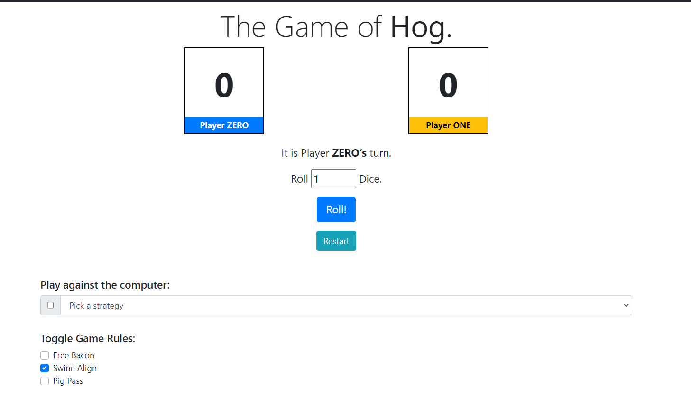

# The Game of Hog
## Rules
In Hog, two players alternate turns trying to be the first to end a turn with at least 100 total points. On each turn, the current player chooses some number of dice to roll, up to 10. That player's score for the turn is the sum of the dice outcomes. However, a player who rolls too many dice risks:

* Pig Out. If any of the dice outcomes is a 1, the current player's score for the turn is 1.

In a normal game of Hog, those are all the rules. To spice up the game, we'll include some special rules:

* Free Bacon. A player who chooses to roll zero dice scores k+3 points, where k is the nth digit of pi after the decimal point, and n is the total score of their opponent. As a special case, if the opponent's score is n = 0, then k = 3 (the digit of pi before the decimal point).


* Swine Align. After points for the turn are added to the current player's score, if both players have a positive score and the Greatest Common Divisor (GCD) of the current player's score and the opponent's score is at least 10, take another turn.


* Pig Pass. After points for the turn are added to the current player's score, if the current player's score is lower than the opponent's score and the difference between them is less than 3, the current player takes another turn.

---
## How to Play
* You can play the graphical version of the game by entering
```python
python3 hog_gui.py
```

